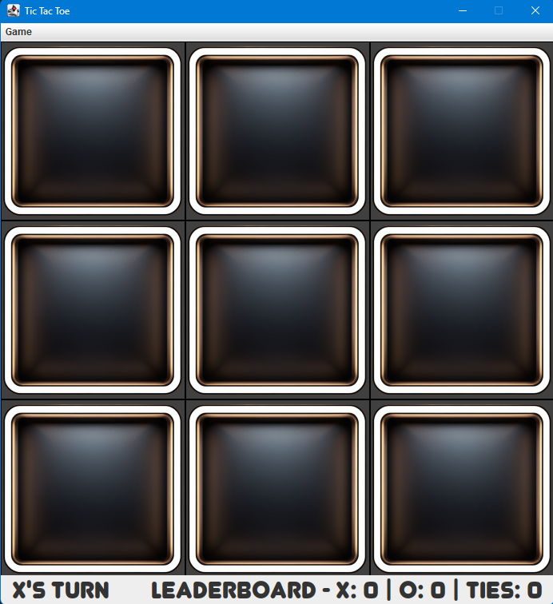
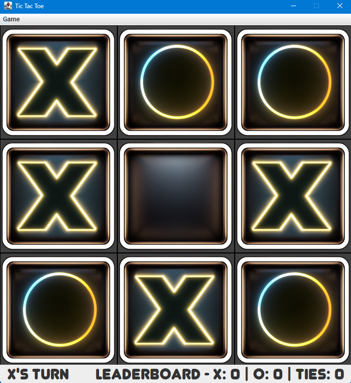
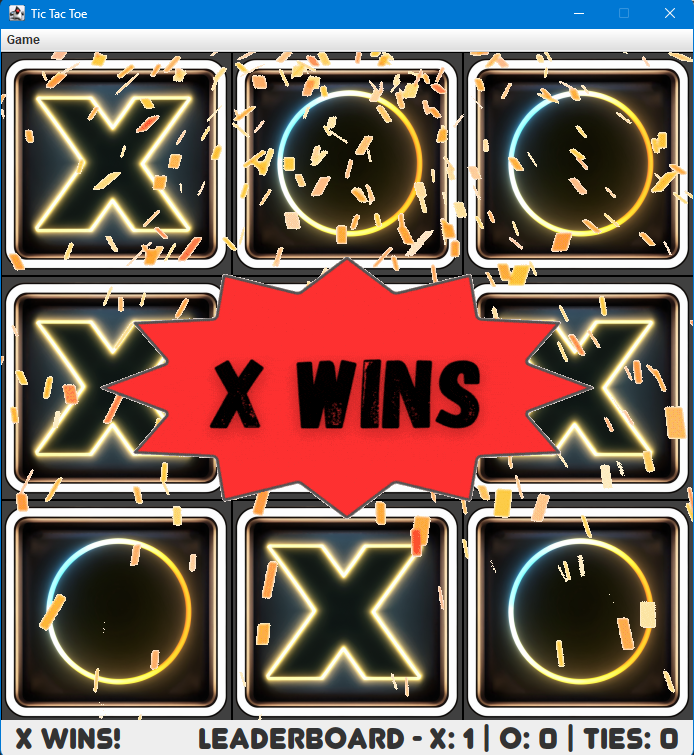

# Tic Tac Toe Game

This is a simple **Tic Tac Toe** game implemented in Java using the Swing framework. The game includes a graphical user interface (GUI), sound effects, and a leaderboard to track wins and ties.

## Features

- 2-player mode with alternating turns.
- Visual feedback for each move.
- Custom created icons & animations
- Animated win and tie notifications.
- Leaderboard to track game results.
- Sound effects for moves, wins, and ties.
- Reset option for starting a new game.

## Prerequisites

- Java version 8

## How to Run
```markdown
1. Download the release with the included JAR file
2. Run JAR file (ensure to have Java 8 downloaded on computer)
```


## Code Overview

The project is organized into three primary classes:

1. **TicTacToeButton.java**:  
   A custom button class representing each cell on the board. It manages its visual state and value (`X`, `O`, or blank).

2. **TicTacToeLogic.java**:  
   Contains the game logic, including turn management, win detection, tie detection, and leaderboard updates.

3. **TicTacToeUI.java**:  
   The graphical user interface (GUI) for the game. It initializes the board, handles user interactions, and displays the status.

## Screenshots

**Initial UI**:



**UI after moves**



**Win animation & Leaderboard update**



## Contributing

Feel free to fork the repository and submit pull requests with improvements or bug fixes.

## Contributors
This project was written by Ethan Ashworth.

## License

Distributed under the Unlicense License. See `LICENSE.txt` for more information.

---
